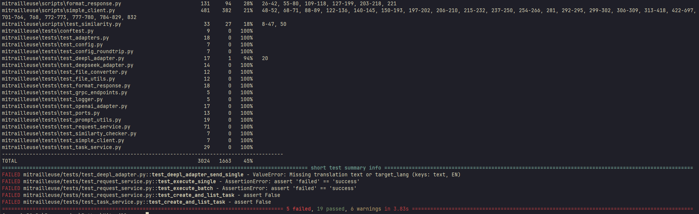

# Mitrailleuse

> **Multi‑provider AI request launcher & batch‑runner** supporting **OpenAI**, **DeepSeek**, and **DeepL**, with a gRPC façade, Dockerised runtime, and sampling‑aware task folders.

> Mitrailleuse is an extensible micro‑service that orchestrates high‑throughput requests to multiple generative‑AI providers (OpenAI, DeepSeek, DeepL) while providing a consistent gRPC interface, pluggable adapters, dynamic prompt mapping, and first‑class batch support.
---

## ✨ Key features

| Capability            | Details                                                                                                                     |
| --------------------- | --------------------------------------------------------------------------------------------------------------------------- |
| 🗂️ Task folders       | Every call lives under `tasks/<user_id>/<api>_<task>_<timestamp>/` (inputs, outputs, logs, config).                         |
| 📡 Multi‑provider     | Switch between `openai`, `deepseek`, `deepl` by setting `api` in the task JSON or `--api` on the CLI.                       |
| 🚀 gRPC service       | Exposes `CreateTask`, `SendSingle`, `CreateBatch`, `CheckBatchStatus`, `DownloadBatchResults`. Reflection & health enabled. |
| 🐳 Docker‑ready       | Single `mitrailleuse-grpc` image builds from `Dockerfile`, spun up via `docker‑compose`.                                    |
| 🔍 Sampling           | `config.general.sampling` lets you process the first *N* lines for quick dry‑runs.                                          |
| 🧩 Adapters           | New providers drop in via `Adapters` registry with `send_single` / `send_batch`.                                            |
| 📜 CLI Interface      | New command-line interface for task management and execution.                                                               |
| 🔄 File Flattening    | Automatic flattening of nested JSON structures for consistent processing.                                                   |
| 🔍 Similarity Check   | Configurable similarity checking to prevent duplicate responses.                                                            |
| 💾 Caching            | In-memory and file-based caching for improved performance.                                                                  |

---

## 🏗️ Architecture

### System Overview

Mitrailleuse follows a clean, layered architecture with clear separation of concerns:

```
┌─────────────────────────────────────────────────────────────────┐
│                        Client Layer                             │
│  ┌─────────────┐  ┌─────────────┐  ┌─────────────────────────┐  │
│  │   CLI       │  │  gRPC       │  │  Other Clients          │  │
│  │  Interface  │  │  Clients    │  │  (Postman, grpcurl)     │  │
│  └─────────────┘  └─────────────┘  └─────────────────────────┘  │
└───────────────────────────┬─────────────────────────────────────┘
                            │ gRPC
┌───────────────────────────▼─────────────────────────────────────┐
│                      Application Layer                          │
│  ┌─────────────────────────────────────────────────────────┐    │
│  │                 gRPC Service Interface                  │    │
│  │  • CreateTask                                           │    │
│  │  • SendSingle                                           │    │
│  │  • CreateBatch                                          │    │
│  │  • CheckBatchStatus                                     │    │
│  │  • DownloadBatchResults                                 │    │
│  └─────────────────────────────────────────────────────────┘    │
└───────────────────────────┬─────────────────────────────────────┘
                            │
┌───────────────────────────▼─────────────────────────────────────┐
│                      Domain Layer                               │
│  ┌─────────────────┐  ┌─────────────────┐  ┌─────────────────┐  │
│  │  Task           │  │  Batch          │  │  Config         │  │
│  │  Management     │  │  Processing     │  │  Management     │  │
│  └─────────────────┘  └─────────────────┘  └─────────────────┘  │
└───────────────────────────┬─────────────────────────────────────┘
                            │
┌───────────────────────────▼─────────────────────────────────────┐
│                    Infrastructure Layer                         │
│  ┌─────────────────┐  ┌─────────────────┐  ┌─────────────────┐  │
│  │  OpenAI         │  │  DeepSeek       │  │  DeepL          │  │
│  │  Adapter        │  │  Adapter        │  │  Adapter        │  │
│  └─────────────────┘  └─────────────────┘  └─────────────────┘  │
└─────────────────────────────────────────────────────────────────┘
```

### Layer Descriptions

#### 1. Client Layer
- **CLI Interface**: Command-line tool for task management and execution
- **gRPC Clients**: Direct gRPC interface consumers
- **Other Clients**: Tools like Postman and grpcurl for testing and integration

#### 2. Application Layer
- **gRPC Service Interface**: Core service endpoints
  - Task creation and management
  - Single request processing
  - Batch job handling
  - Status monitoring
  - Result retrieval

#### 3. Domain Layer
- **Task Management**: Handles task lifecycle and organization
  - Task creation and validation
  - Directory structure management
  - Status tracking
- **Batch Processing**: Manages batch operations
  - Job queuing and scheduling
  - Progress monitoring
  - Result aggregation
- **Config Management**: Configuration handling
  - Provider-specific settings
  - General system configuration
  - Dynamic prompt mapping

#### 4. Infrastructure Layer
- **Provider Adapters**: Implements provider-specific logic
  - OpenAI Adapter: GPT models and batch processing
  - DeepSeek Adapter: Chat completion support
  - DeepL Adapter: Translation services

### Key Architectural Features

1. **Task Organization**
   - Hierarchical task structure: `tasks/<user_id>/<api>_<task>_<timestamp>/`
   - Separate directories for inputs, outputs, logs, and configuration
   - Automatic file flattening for consistent processing

2. **Provider Abstraction**
   - Common interface for all AI providers
   - Pluggable adapter system for easy provider addition
   - Consistent error handling and response formatting

3. **Batch Processing**
   - Configurable batch sizes and check intervals
   - Support for batch combination and file-based batching
   - Progress tracking and status monitoring

4. **Performance Optimizations**
   - In-memory and file-based caching
   - Configurable sampling for quick testing
   - Similarity checking to prevent duplicate processing

5. **Monitoring and Logging**
   - Comprehensive logging system
   - Health checks and reflection support
   - Batch job status tracking

### Data Flow

1. **Task Creation**
   ```
   Client → gRPC Service → Task Manager → Directory Creation → Config Setup
   ```

2. **Request Processing**
   ```
   Client → gRPC Service → Task Manager → Provider Adapter → AI Provider
   ```

3. **Batch Processing**
   ```
   Client → gRPC Service → Batch Manager → Provider Adapter → AI Provider
   ```

4. **Result Handling**
   ```
   AI Provider → Provider Adapter → Result Processor → Output Storage
   ```

## Quick start

### Prerequisites

* Python 3.12+
* Docker 24.x (optional but recommended)
* Provider API keys in config.json

### 1 · Clone & build

```bash
# clone
git clone https://github.com/theFellandes/mitrailleuse.git
cd mitrailleuse

# Create and activate virtual environment
python -m venv .venv
source .venv/bin/activate  # On Windows: .venv\Scripts\activate

# Install package in development mode
pip install -e .

# Install dependencies
pip install -r requirements.txt

# Generate gRPC stubs
python -m grpc_tools.protoc -I. \
  --python_out=. --grpc_python_out=. mitrailleuse/proto/mitrailleuse.proto

# build the gRPC server image (if using Docker)
docker compose build mitrailleuse-grpc
```

### 2 · Set API keys

Create `.env` in the repo root:

```dotenv
OPENAI_API_KEY=sk‑...
DEEPSEEK_API_KEY=dsk‑...
DEEPL_API_KEY=dpa‑...
```

### 3 · Run the stack

#### Option 1: Run directly with Python
```bash
# Start the gRPC server
python -m mitrailleuse.infrastructure.grpc.server
```

#### Option 2: Run with Docker
```bash
docker compose up -d mitrailleuse-grpc
```

The server listens on **`localhost:50051`** (gRPC, plaintext).

### 4 · Smoke test

```bash
grpcurl -plaintext localhost:50051 list
```

Should list `mitrailleuse.MitrailleuseService`.

---

## 🔧 Configuration files

### `config.json` template

```jsonc
{
  "task_name": "openai_test_shot_21_04_2025_155231",
  "user_id": "user1",

  "openai": {
    "batch": {
      "is_batch_active": true,
      "batch_check_time": 120,
      "batch_size": 20,
      "combine_batches": false
    },
    "prompt": "input_text",
    "system_instruction": {
      "is_dynamic": false,
      "system_prompt": ""
    },
    "api_key": "YOUR_OPENAI_KEY",
    "api_information": {
      "model": "gpt-4o",
      "setting": {
        "temperature": 1.0,
        "max_tokens": 16000
      }
    },
    "bulk_save": 10,
    "sleep_time": 0
  },

  "deepseek": {
    "batch": {
      "is_batch_active": true,
      "batch_check_time": 120,
      "batch_size": 20,
      "combine_batches": false
    },
    "prompt": "input_text",
    "system_instruction": {
      "is_dynamic": false,
      "system_prompt": ""
    },
    "api_key": "",
    "api_information": {
      "model": "gpt-4o",
      "setting": {
        "temperature": 1.0,
        "max_tokens": 16000
      }
    },
    "bulk_save": 10,
    "sleep_time": 0
  },

  "deepl": {
    "api_key": "",
    "target_lang": "target_lang",
    "text": "text"
  },

  "general": {
    "verbose": true,
    "sampling": {
      "enable_sampling": true,
      "sample_size": 100
    },
    "logs": {
      "log_file": "log.log",
      "log_to_file": true,
      "log_to_db": false,
      "log_buffer_size": 10
    },
    "multiprocessing_enabled": true,
    "num_processes": 10,
    "process_cap_percentage": 75,
    "proxies": {
      "proxies_enabled": false,
      "http": "http://corporate-proxy:8080/",
      "https": "http://corporate-proxy:8080/"
    },

    "db": {
      "postgres": {
        "host": "localhost",
        "port": "5432",
        "username": "postgres",
        "password": "postgres",
        "database": "mitrailleuse"
      }
    },

    "similarity_check": {
      "enabled": false,
      "settings": {
        "similarity_threshold": 0.8,
        "cooldown_period": 300,
        "max_recent_responses": 100,
        "close_after_use": false
      }
    }
  }
}

```

### Configuration Fields

#### Root Level
- `task_name` (string): Unique identifier for the task
- `user_id` (string): User identifier for task organization

#### OpenAI Configuration
- `api_key` (string): OpenAI API key (use environment variable `${OPENAI_API_KEY}`)
- `api_information`:
  - `model` (string): OpenAI model to use (e.g., "gpt-4", "gpt-3.5-turbo")
  - `setting`:
    - `temperature` (float): Controls randomness (0.0 to 1.0)
    - `max_tokens` (integer): Maximum tokens in response
- `prompt` (string): Field name in input JSON containing the prompt
- `system_instruction`:
  - `is_dynamic` (boolean): Whether to use dynamic system prompts
  - `system_prompt` (string): Default system prompt if not dynamic
- `batch`:
  - `is_batch_active` (boolean): Enable batch processing
  - `batch_size` (integer): Number of items per batch
  - `batch_check_time` (integer): Seconds between batch status checks
  - `combine_batches` (boolean): Whether to combine batch results
  - `file_batch` (boolean): Use file-based batch processing

#### General Configuration
- `verbose` (boolean): Enable detailed logging
- `multiprocessing_enabled` (boolean): Enable parallel processing
- `num_processes` (integer): Number of parallel processes
- `process_cap_percentage` (integer): Maximum CPU usage percentage
- `logs`:
  - `log_file` (string): Path to log file
  - `log_to_file` (boolean): Enable file logging
  - `log_buffer_size` (integer): Number of log entries to buffer
- `sampling`:
  - `enable_sampling` (boolean): Enable input sampling
  - `sample_size` (integer): Number of items to sample
- `similarity_check`:
  - `enabled` (boolean): Enable response similarity checking
  - `settings`:
    - `similarity_threshold` (float): Minimum similarity score (0.0 to 1.0)
    - `cooldown_period` (integer): Seconds to wait after similar response
    - `max_recent_responses` (integer): Number of responses to check
    - `close_after_use` (boolean): Close similarity checker after each use

### Environment Variables
```bash
export OPENAI_API_KEY="sk-..."  # Your OpenAI API key
```

### Best Practices

1. **API Keys**
   - Never commit API keys to version control
   - Use environment variables for sensitive data
   - Rotate keys regularly

2. **Batch Processing**
   - Adjust batch size based on API limits
   - Monitor batch check time for rate limits
   - Use file batch for large datasets

3. **Resource Management**
   - Set process cap based on system resources
   - Monitor memory usage with large batches
   - Adjust buffer sizes for your workload

4. **Similarity Checking**
   - Start with high threshold (0.8)
   - Adjust cooldown based on API limits
   - Monitor response quality

---

## 🖥️ CLI Usage

The CLI provides a powerful interface for task management, execution, and inspection. All commands are run via the main entrypoint:

```bash
python -m mitrailleuse.main <command> [options]
```

### Commands

- **create**: Create a new task folder and config
- **list**: List all tasks for a user (or all users)
- **get**: Show details for a specific task folder
- **execute**: Run a task (single or batch)

### Examples

```bash
# Create a new task
python -m mitrailleuse.main create --user-id user1 --api-name openai --task-name demo

# List all tasks for a user
python -m mitrailleuse.main list --user-id user1

# List all tasks for all users
python -m mitrailleuse.main list --user-id all

# Get info for a specific task
python -m mitrailleuse.main get --task-path /path/to/task

# Execute a task by name
python -m mitrailleuse.main execute --user-id user1 --task-name openai_test_20250520_141029

# Execute a task by number (from the list)
python -m mitrailleuse.main execute --user-id user1 --task-number 2
```

### Command Reference

- `create`: Create a new task
  - `--user-id <user>`: User ID (required)
  - `--api-name <api>`: API provider (openai, deepseek, deepl) (required)
  - `--task-name <name>`: Task name (required)
  - `--config <file>`: Path to custom config (optional)
- `list`: List tasks
  - `--user-id <user>`: User ID (required, or 'all')
  - `--all`: List all users (optional)
- `get`: Get task info
  - `--task-path <path>`: Path to task directory (required)
- `execute`: Execute a task
  - `--user-id <user>`: User ID (required)
  - `--task-name <name>`: Task name (optional)
  - `--task-number <n>`: Task number from list (optional)

### Features

* Interactive task selection
* Batch job monitoring (with progress)
* Automatic config loading
* Logs to both console and logs/ directory
* Supports all providers (OpenAI, DeepSeek, DeepL)

---

# <InstructionsManual>

## Mitrailleuse Instructions Manual

### 1. Overview
Mitrailleuse is a multi-provider AI batch runner and request orchestrator. It supports OpenAI, DeepSeek, and DeepL, and provides a unified CLI and gRPC interface for high-throughput, reproducible AI tasks.

### 2. Installation

- Python 3.12+
- (Optional) Docker 24.x+
- Install dependencies:
  ```bash
  python -m venv .venv
  source .venv/bin/activate  # or .venv\Scripts\activate on Windows
  pip install -e .
  pip install -r requirements.txt
  ```
- Generate gRPC stubs:
  ```bash
  python -m grpc_tools.protoc -I. --python_out=. --grpc_python_out=. mitrailleuse/proto/mitrailleuse.proto
  ```
- Set API keys in `.env` in the repo root.

### 3. Running the gRPC Server

- Direct:
  ```bash
  python -m mitrailleuse.infrastructure.grpc.server
  ```
- Docker:
  ```bash
  docker compose up -d mitrailleuse-grpc
  ```

### 4. Using the CLI

- See the CLI Usage section above for all commands.
- All task folders are created under `tasks/<user_id>/<api>_<task>_<timestamp>/`.
- Place your input files (JSON/JSONL) in the `inputs/` subfolder of the task directory.
- Outputs, logs, and cache are automatically managed.

### 5. Task Lifecycle

1. **Create a task**: Generates a new folder and config.
2. **Add inputs**: Place your `.json` or `.jsonl` files in the `inputs/` directory.
3. **Execute**: Run the task via CLI or gRPC. Results are written to `outputs/`.
4. **Inspect**: Use the CLI or inspect files directly. Logs are in `logs/`.

### 6. gRPC API

- See the gRPC API reference in this README for all endpoints and message types.
- You can use `grpcurl` or Postman for direct gRPC calls.
- Reflection is enabled for easy discovery.

### 7. Configuration

- Each task has its own `config/config.json`.
- See the Configuration Files section for all options.
- You can override config at task creation with `--config`.

### 8. Batch Processing

- Enable batch mode in config (`openai.batch.is_batch_active: true`).
- Batches are split automatically based on `batch_size`.
- Progress is tracked and shown in the CLI for batch jobs.

### 9. Logging & Monitoring

- All actions are logged to both console and `logs/`.
- Batch jobs are monitored live if run via CLI.
- Errors and warnings are clearly reported.

### 10. Best Practices

- Use environment variables for API keys.
- Use sampling for quick dry-runs on large datasets.
- Monitor logs for errors and progress.
- Use the CLI for all routine operations; use gRPC for integration.
- Regularly clean up old tasks to save space.

### 11. Troubleshooting

- If a task fails, check the `logs/` directory in the task folder.
- For gRPC errors, ensure the server is running and reachable.
- For API errors, check your API keys and config.
- Use `python -m mitrailleuse.main list --user-id all` to see all tasks and their status.

### 12. Extending Mitrailleuse

- Add new providers by implementing the `APIPort` interface and registering in `ADAPTERS`.
- Add new CLI commands by editing `main.py`.
- See the codebase for more extension points.

<InstructionsManual>

## 🎯 SimpleClient - Core Application

The SimpleClient is a standalone Python application that provides direct access to AI providers without requiring the gRPC server. It's designed for high-throughput processing of AI requests with advanced features like caching, similarity checking, and batch processing.

### Key Features

- **Direct Provider Integration**: Direct integration with OpenAI, DeepSeek, and DeepL APIs
- **Advanced Caching**: In-memory and file-based caching for improved performance
- **Similarity Checking**: Prevents duplicate responses with configurable thresholds
- **Batch Processing**: Efficient batch processing with progress monitoring
- **File Management**: Automatic file conversion and organization
- **Resource Management**: Dynamic thread management based on system resources

### Usage

```python
from mitrailleuse.scripts.simple_client import SimpleClient

# Initialize client with config
client = SimpleClient("path/to/config.json")

# Process files with OpenAI
results = await client.process_all_files(service="openai")

# Process files with DeepL
results = await client.process_all_files(service="deepl")
```

### Directory Structure

```
task_directory/
├─ config/
│   └─ config.json           # Task-specific configuration
├─ inputs/
│   ├─ backup/              # Original input file backups
│   ├─ original/            # Preserved original files
│   └─ *.json/jsonl         # Input files to process
├─ outputs/
│   ├─ *_raw_response.json  # Raw API responses
│   ├─ *_formatted_response.json  # Formatted responses
│   └─ parsed_*_response.jsonl    # Parsed content
├─ cache/                   # Response cache
└─ logs/                    # Processing logs
```

### Configuration

The SimpleClient uses a JSON configuration file with the following structure:

```json
{
    "task_name": "openai_test",
    "user_id": "user1",
    "openai": {
        "api_key": "YOUR_OPENAI_KEY",
        "api_information": {
            "model": "gpt-4",
            "setting": {
                "temperature": 0.7,
                "max_tokens": 2000
            }
        },
        "prompt": "input_text",
        "system_instruction": {
            "is_dynamic": false,
            "system_prompt": ""
        },
        "batch": {
            "is_batch_active": true,
            "batch_size": 5,
            "batch_check_time": 120,
            "combine_batches": false,
            "file_batch": false
        }
    },
    "general": {
        "verbose": true,
        "multiprocessing_enabled": true,
        "num_processes": 4,
        "process_cap_percentage": 75,
        "logs": {
            "log_file": "log.log",
            "log_to_file": true,
            "log_buffer_size": 10
        },
        "sampling": {
            "enable_sampling": false,
            "sample_size": 50
        },
        "similarity_check": {
            "enabled": false,
            "settings": {
                "similarity_threshold": 0.8,
                "cooldown_period": 300,
                "max_recent_responses": 100,
                "close_after_use": false
            }
        }
    }
} 
```

### Performance Features

1. **Resource Management**
   - Dynamic thread calculation based on CPU cores
   - Configurable process cap percentage
   - Automatic resource scaling

2. **Caching System**
   - In-memory caching for frequent requests
   - File-based caching for persistence
   - Configurable cache size and expiration

3. **Batch Processing**
   - Configurable batch sizes
   - Progress monitoring
   - Automatic retry on failure
   - Batch combination options

4. **Similarity Checking**
   - Configurable similarity thresholds
   - Cooldown periods
   - Recent response tracking
   - Automatic duplicate prevention

### Error Handling

- Comprehensive error logging
- Automatic retry mechanisms
- Detailed error reporting
- Graceful failure handling

### Example Workflow

```python
async def process_files():
    # Initialize client
    client = SimpleClient("config.json")
    
    try:
        # Process with OpenAI
        openai_results = await client.process_all_files(service="openai")
        
        # Process with DeepL
        deepl_results = await client.process_all_files(service="deepl")
        
        # Get cache statistics
        cache_stats = client.get_cache_stats()
        print(f"Cache hits: {cache_stats['hits']}")
        
    finally:
        # Clean up resources
        client.close()
```

### Best Practices

1. **Resource Management**
   - Use appropriate batch sizes
   - Monitor system resources
   - Implement proper cleanup

2. **Error Handling**
   - Implement retry mechanisms
   - Log errors appropriately
   - Handle API rate limits

3. **Performance**
   - Utilize caching effectively
   - Configure similarity checking
   - Optimize batch sizes

4. **Security**
   - Secure API key storage
   - Implement proper access controls
   - Monitor API usage

---

## 🗄️ Directory structure (runtime)

```
mitrailleuse/
├─ mitrailleuse/
│   ├─ proto/
│   │   ├─ mitrailleuse.proto
│   │   ├─ mitrailleuse_pb2.py
│   │   └─ mitrailleuse_pb2_grpc.py
│   ├─ infrastructure/
│   │   ├─ grpc/
│   │   │   └─ server.py
│   │   └─ ...
│   └─ ...
├─ tasks/
│   └─ alice/
│       └─ openai_demo_03_05_2025_142530/
│           ├─ config/config.json
│           ├─ inputs/
│           │   ├─ backup/
│           │   └─ ...
│           ├─ outputs/
│           ├─ cache/
│           └─ logs/
│               ├─ app.log
│               └─ batch.log
└─ ...
```

---

## 🛰️ gRPC API reference

```proto
service MitrailleuseService {
  rpc CreateTask (CreateTaskRequest) returns (CreateTaskResponse);
  rpc ExecuteTask (ExecuteTaskRequest) returns (ExecuteTaskResponse);
  rpc GetTaskStatus (GetTaskStatusRequest) returns (GetTaskStatusResponse);
  rpc ListTasks (ListTasksRequest) returns (ListTasksResponse);
  rpc GetTaskByPath (GetTaskByPathRequest) returns (TaskInfo);
}

// Request/Response Messages
message CreateTaskRequest {
  string user_id = 1;
  string api_name = 2;
  string task_name = 3;
  string config_json = 4;  // raw json of Config
}

message CreateTaskResponse {
  string task_folder = 1;
}

message ExecuteTaskRequest {
  string user_id = 1;
  string task_folder = 2;
}

message ExecuteTaskResponse {
  string status = 1;
  string job_id = 2;   // empty when not a batch
}

message GetTaskStatusRequest {
  string user_id = 1;
  string task_folder = 2;
}

message GetTaskStatusResponse {
  string status = 1;
}

message ListTasksRequest {
  string user_id = 1;
  string task_name = 2;
}

message ListTasksResponse {
  repeated TaskInfo tasks = 1;
}

message GetTaskByPathRequest {
  string task_path = 1;
}

message TaskInfo {
  string user_id = 1;
  string api_name = 2;
  string task_name = 3;
  string status = 4;
  string path = 5;
}
```

*Reflection* is enabled: Postman & `grpcurl` can auto‑discover.

---

## 🐳 Docker compose

```yaml
services:
  mitrailleuse-grpc:
    build: ./mitrailleuse/grpc
    ports:
      - "50051:50051"
    env_file: .env
    volumes:
      - ./tasks:/app/tasks
```

---

## 🧪 Development & testing

```bash
python -m venv .venv
source .venv/bin/activate
pip install -r requirements.txt
pytest -q
black . --check
```

Generate updated stubs:

```bash
python -m grpc_tools.protoc -I. \ 
  --python_out=. --grpc_python_out=. mitrailleuse.proto
```

## 🧪 Running Unit Tests & Coverage

Mitrailleuse includes a comprehensive suite of unit and integration tests to ensure reliability and maintainability. All tests are located in the `tests/` directory.

### Running All Tests

To run all tests, simply execute:

```bash
pytest
```

### Checking Test Coverage

To check code coverage and see which lines are tested, use:

```bash
pytest --cov=mitrailleuse --cov-report=term-missing
```

- This will show a summary of coverage for each file and highlight missing lines.
- For a detailed HTML report, run:

```bash
pytest --cov=mitrailleuse --cov-report=html
# Then open htmlcov/index.html in your browser
```

### Running a Specific Test File

You can run a specific test file like this:

```bash
pytest tests/test_request_service.py
```

### Troubleshooting Test Failures

- If you see `ModuleNotFoundError: No module named 'mitrailleuse'`, make sure you are running pytest from the project root and that your virtual environment is activated.
- If you see assertion errors, check the printed output for clues about what failed.
- For debugging, you can add `print()` statements or use `pytest -s` to see stdout.

### Test Organization

- **Unit tests** for core modules: `tests/test_*.py`
- **Adapter tests**: `tests/test_deepl_adapter.py`, `tests/test_deepseek_adapter.py`, `tests/test_openai_adapter.py`
- **Utility tests**: `tests/test_file_converter.py`, `tests/test_prompt_utils.py`, etc.
- **Script/CLI tests**: `tests/test_simple_client.py`, `tests/test_format_response.py`

### Best Practices

- Run tests before every commit or pull request.
- Aim for at least 80% coverage (see coverage report for details).
- Add new tests for any new features or bug fixes.

---

## 📜 License

MIT – see `LICENSE`.

---

## 🗺️ Roadmap

* [ ] DeepSeek batch support when API ships
* [ ] Streaming gRPC endpoint
* [ ] Web dashboard for task monitoring
* [ ] Kubernetes Helm chart
* [ ] Enhanced similarity checking with more algorithms
* [ ] Support for more AI providers

---

## Current Coverage



## Contributions

Contributions welcome — see `CONTRIBUTING.md`.
